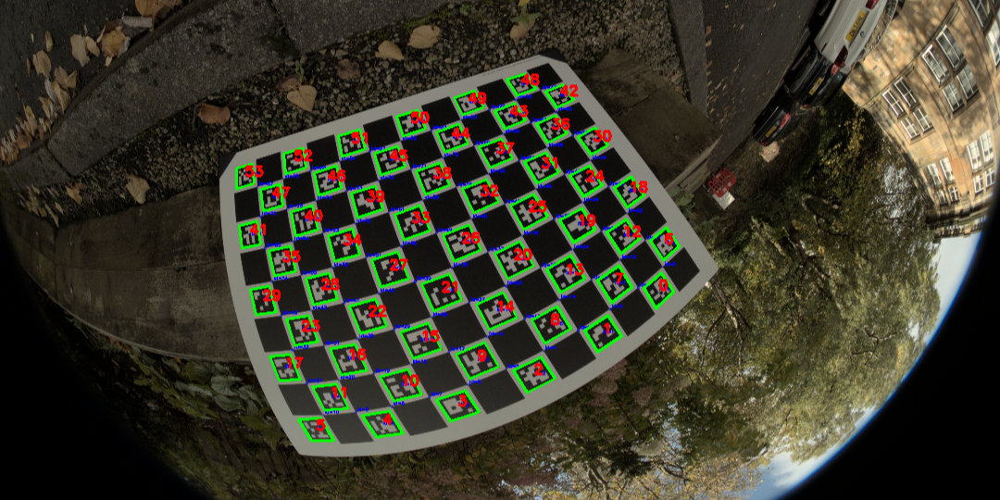
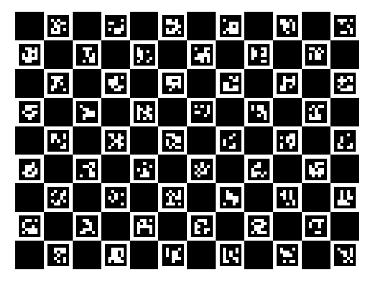
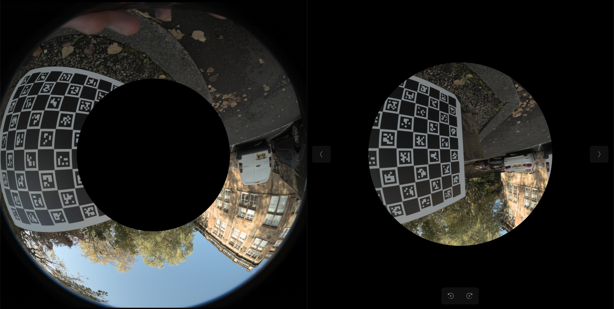
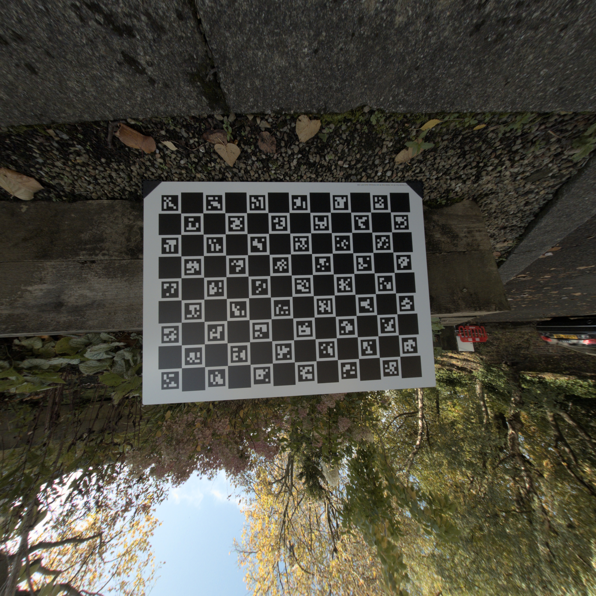

Camera calibration is a crucial step in computer vision applications, particularly when working with wide-angle or fisheye lenses. In this article, I'll share my implementation of a Python-based camera calibration system using ChArUco boards, which offers superior accuracy and ease of use compared to traditional calibration methods.

## What are ChArUco Boards?

ChArUco boards represent a hybrid approach to camera calibration, combining the robustness of ArUco markers with the precision of chessboard patterns. This combination provides several key advantages:

- Robust detection even with partial board occlusion
- Automatic and accurate corner detection
- Unique identification of each corner position



## Implementation Overview

I've developed a comprehensive Python package that handles both the calibration process and subsequent image correction. The system supports both traditional pinhole cameras and ultra-wide fisheye lenses, with special attention paid to the unique distortion characteristics of fisheye optics.

### Core Features

- Automated ChArUco board generation
- Support for both fisheye and pinhole camera models
- Flexible calibration parameters
- Batch processing of calibration images
- Export compatibility with COLMAP format
- Advanced concentric camera splitting for ultra-wide lenses

## Getting Started with Calibration

The calibration process I've developed follows a straightforward workflow:

1. **Environment Setup**
   ```python
   python -m venv myenv
   source myenv/bin/activate  # macOS/Linux
   myenv\Scripts\activate     # Windows
   pip install -e .
   ```

2. **Board Generation**
   ```python
   calibrator.generate_charuco_board()
   ```
   

3. **Image Capture Guidelines**
   For optimal calibration results, I recommend:
   - Capturing 10-20 images from various angles
   - Ensuring even lighting conditions
   - Including shots with board tilts and rotations
   - Maintaining clear focus and avoiding motion blur

## Advanced Features: Concentric Camera Splitting

One unique aspect of my implementation is the ConcentricCamera class, designed specifically for ultra-wide fisheye lenses. This feature addresses a common challenge in ultra-wide angle calibration: varying distortion parameters across different regions of the image.



The system splits the image into concentric regions, allowing for more accurate calibration across the entire field of view. This is particularly valuable for:
- Ultra-wide fisheye lenses (>180° FoV)
- Applications requiring high precision across the entire image
- Scenarios with varying distortion characteristics

## Results and Image Correction

After calibration, the system can effectively correct for lens distortion:



The corrected images maintain high quality while removing the characteristic fisheye distortion, making them suitable for further computer vision processing.

## Code Structure and Organization

The project follows a clean, modular structure:
```
├── data
│   ├── calibration
│   │   ├── camera_intrinsics
│   │   └── images
│   ├── raw_images
│   ├── undistorted_images
│   └── virtual_cameras
├── src
│   ├── calibration
│   └── virtual_camera
└── tests
```

## Conclusion

This camera calibration system provides a robust solution for both standard and ultra-wide angle lens calibration needs. The integration of ChArUco boards with specialized handling of fisheye distortion makes it particularly valuable for applications requiring high precision across wide fields of view.

For detailed implementation information or to contribute to the project, please visit the GitHub repository. I welcome feedback and contributions from the computer vision community.