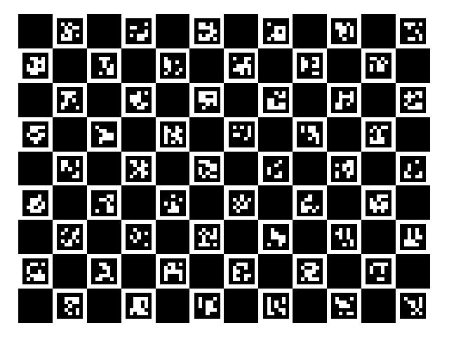

Accurate camera calibration is crucial in computer vision applications. Understanding how apparent distortion varies across your camera sensor is fundamental to building robust applications. This is particularly important with fisheye cameras, where an object's appearance can differ dramatically between the centre and edges of the frame.

Whilst deep learning approaches might suggest we can bypass the need to understand the mathematical relationship between input light rays and image pixels, I would argue that for safety-critical applications, such as autonomous vehicles, this relationship remains essential. Relying solely on training data to cover all edge cases is far riskier than having a sound mathematical foundation.

In this article, I'll demonstrate my implementation of a camera calibration system using ChArUco boards and OpenCV in Python. This approach offers great accuracy and usability compared to traditional methods such as standard chessboard patterns.

## How to Calibrate a Camera

Camera calibration determines the unique mathematical relationship between incoming light rays and their corresponding pixel locations for a specific camera. This relationship is represented by two key components: intrinsic parameters (internal camera properties like focal length and lens distortion) and extrinsic parameters (the camera's position and orientation in space).


Whilst the mathematics behind camera calibration is fascinating, this article focuses on practical implementation using OpenCV and ChArUco boards. For those interested in the underlying theory, OpenCV's documentation provides an excellent deep dive into the mathematical foundations.

## What are ChArUco Boards?


To calibrate a camera, we need to establish a relationship between known 3D points in space (object points) and their corresponding 2D projections in the image (image points). Traditional approaches have relied on chessboard patterns, using their distinctive black and white corners as reference points. These corners, formed by intersecting straight lines, provide reliable features for detection.

ArUco markers, on the other hand, are square fiducial markers with unique binary patterns that can be robustly detected and identified. Their main advantage lies in their ability to be recognised even when partially obscured, thanks to their built-in error correction and unique identification.

ChArUco boards cleverly combine these approaches, interpolating chessboard corners using the precisely located ArUco markers. This hybrid approach offers several key advantages:

- Robust detection even with partial board occlusion
- Automatic and accurate corner detection
- Unique identification of each corner position
- Enhanced accuracy through redundant measurements
- Reliable performance under varying lighting conditions


## Implementation Overview

I've developed a comprehensive Python package that handles both the calibration process and subsequent image correction. The system supports both traditional pinhole cameras and ultra-wide fisheye lenses, with special attention paid to the unique distortion characteristics of fisheye optics.

### Core Features

- Automated ChArUco board generation
- Support for both fisheye and pinhole camera models
- Flexible calibration parameters
- Batch processing of calibration images
- Export compatibility with COLMAP format
- Advanced concentric camera splitting for ultra-wide lenses

## Getting Started with Calibration

The calibration process I've developed follows a straightforward workflow:

1. **Environment Setup**
   ```python
   python -m venv myenv
   source myenv/bin/activate  # macOS/Linux
   myenv\Scripts\activate     # Windows
   pip install -e .
   ```

2. **Board Generation**
   ```python
   calibrator.generate_charuco_board()
   ```
   

3. **Image Capture Guidelines**
   For optimal calibration results, I recommend:
   - Capturing 10-20 images from various angles
   - Ensuring even lighting conditions
   - Including shots with board tilts and rotations
   - Maintaining clear focus and avoiding motion blur

## Advanced Features: Concentric Camera Splitting

One unique aspect of my implementation is the ConcentricCamera class, designed specifically for ultra-wide fisheye lenses. This feature addresses a common challenge in ultra-wide angle calibration: varying distortion parameters across different regions of the image.


The system splits the image into concentric regions, allowing for more accurate calibration across the entire field of view. This is particularly valuable for:
- Ultra-wide fisheye lenses (>180° FoV)
- Applications requiring high precision across the entire image
- Scenarios with varying distortion characteristics

## Results and Image Correction

After calibration, the system can effectively correct for lens distortion:


The corrected images maintain high quality while removing the characteristic fisheye distortion, making them suitable for further computer vision processing.

## Code Structure and Organization

The project follows a clean, modular structure:
```
├── data
│   ├── calibration
│   │   ├── camera_intrinsics
│   │   └── images
│   ├── raw_images
│   ├── undistorted_images
│   └── virtual_cameras
├── src
│   ├── calibration
│   └── virtual_camera
└── tests
```

## Conclusion

This camera calibration system provides a robust solution for both standard and ultra-wide angle lens calibration needs. The integration of ChArUco boards with specialized handling of fisheye distortion makes it particularly valuable for applications requiring high precision across wide fields of view.

For detailed implementation information or to contribute to the project, please visit the GitHub repository. I welcome feedback and contributions from the computer vision community.